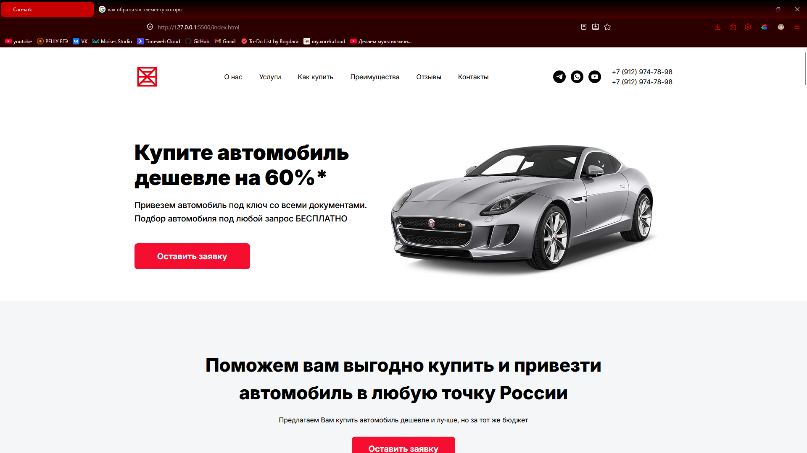

# Carmark — лендинг автосалона / автоподбора

Одностраничный сайт автосалона/сервиса автоподбора: промо-блок, секции услуг и преимуществ, команда, отзывы, видео-блок, форма заявки и контакты.

## Демо

- **Ссылка**: `https://serge-bogdanov.github.io/autoservice-landing/`

## Технологии и принципы

- **Без библиотек**: чистый HTML/CSS и **vanilla JavaScript** (без фреймворков и UI-kit’ов)
- **БЭМ**: именование и структура классов
- **Адаптив**: responsive-вёрстка под разные экраны

## Кастомные UI-компоненты и интерактив

- **Бургер-меню** с мобильной логикой (динамически добавляет элементы в меню на малых разрешениях)
- **Карусели** на нативном скролле (поддержка клонов для “бесконечного” пролистывания)
- **Видео-превью → YouTube iframe** по клику
- **Плавная навигация** по якорям
- **Анимации появления** секций через `IntersectionObserver`
- **Форма заявки**: маска номера телефона + валидация + уведомления (toast)

## Примечание про данные

В репозитории используются **тестовые/заглушечные** имена и контакты — реальные данные **скрыты**.
